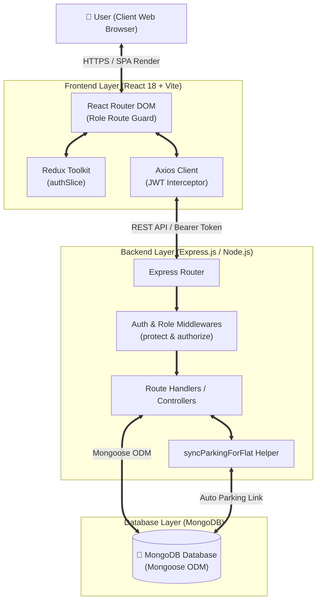
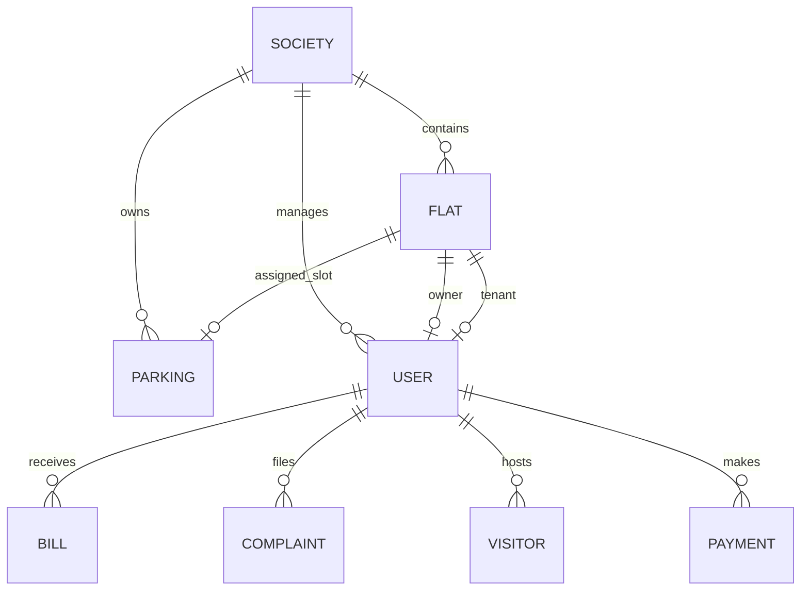
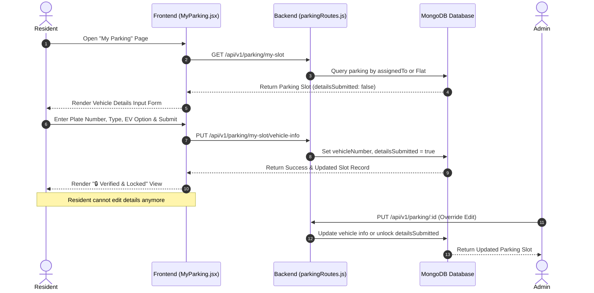

# System Architecture
## Apartment Management System (ApartmentMS)

---

## 1. Project Overview

- **Project Name**: Apartment Management System (`ApartmentMS`)
- **Purpose**: An enterprise multi-society apartment and residential complex management platform designed to automate flat allocation, parking assignments, monthly billing, gate security, maintenance ticketing, notice broadcasts, community events, and waste tracking.
- **Main Users**:
  - **System Admin**: Complete management authority over societies, flats, billing, users, events, and parking overrides.
  - **Resident (Owner / Tenant)**: Access to flat details, locked vehicle registration, bill payments, complaint filing, visitor pre-approvals, and event viewing.
  - **Security Guard**: Gate pass management, visitor entry/exit verification, gate parking tracking, and incident viewing.
  - **Maintenance Staff**: Maintenance ticket resolution, waste collection logging, and facility status inspection.
- **Main Functionality**:
  - **Multi-Society & Flat Management**: Automatic flat numbering (`GVS-01`), BHK presets, floor calculation, and block validation.
  - **1-to-1 Dedicated Parking System**: Automatic flat-to-parking slot generation (`GVS-P-01`), resident vehicle registration, permanent detail locking (`detailsSubmitted`), and admin rate overrides.
  - **Billing & Invoicing Engine**: Individual & bulk bill generation for maintenance, parking, water, and electricity with online payment support.
  - **Gate Pass Security**: Visitor logging, entry/exit timestamping, and pre-approval passes.
  - **Ticketing & Maintenance**: Role-based complaint workflow (`pending` → `in_progress` → `resolved`).
  - **Interactive AI Assistant**: Embedded AI chat bubble (`AIChatBubble.jsx`) providing instant user assistance across the platform.
- **Overall Architecture Approach**: A decoupled Full-Stack MERN architecture (React Single Page Application + Node.js/Express REST API + MongoDB NoSQL Database).

---

## 2. High-Level Architecture



---

## 3. Architecture Style

- **Decoupling**: Fully decoupled Client-Server architecture. The frontend is built as a static Single Page Application (SPA) communicating exclusively via RESTful JSON APIs to the Express backend.
- **Client-Server Communication**: Asynchronous HTTP requests handled by Axios with automatic Bearer token injection and global 401 response interceptors.
- **API Architecture**: Resource-based REST API routing prefixed under `/api/v1/` (`/api/v1/auth`, `/api/v1/flats`, `/api/v1/parking`, `/api/v1/billing`, etc.).
- **Authentication Architecture**: Stateless JSON Web Tokens (JWT). Upon authentication, the token is stored in `localStorage` and sent in the `Authorization: Bearer <token>` header for protected endpoints.
- **Data Access Architecture**: Mongoose Object-Document Mapper (ODM) enforcing schema structures, validation rules, default fallbacks, and multi-model population (`populate()`).
- **State Management**: Dual-tier state architecture:
  - **Global App State**: Managed via Redux Toolkit (`authSlice.js`) for user credentials and token state.
  - **Component Local State**: React `useState` / `useEffect` hooks for form control, filter dropdowns, and modal toggles.
- **Error Handling**:
  - **Backend**: Express error handling pipeline featuring custom `notFound` and `errorHandler` middlewares.
  - **Frontend**: API error response parsing displayed via `react-hot-toast` notifications.

---

## 4. Technology Stack

| Layer | Technology | Purpose |
| :--- | :--- | :--- |
| **Frontend Framework** | React.js (`v19` / React 18 compatible) | Single Page Application component framework |
| **Build Tool** | Vite (`v8.0`) | Development server and production bundling |
| **Language** | JavaScript (ES6+ Modules) | Primary development language for client and server |
| **Styling** | TailwindCSS (`v3.4`) | Utility-first responsive design and custom scrollbars |
| **Database** | MongoDB + Mongoose (`v9.3`) | NoSQL document store and object modeling ODM |
| **Backend Engine** | Node.js (`v20.x`) + Express (`v4.18`) | REST API backend web application framework |
| **Authentication** | JSON Web Tokens (`jsonwebtoken v9.0`) | Stateless JWT bearer token authorization |
| **Password Hashing** | BcryptJS (`v3.0`) | One-way salt hashing for user passwords |
| **State Management** | Redux Toolkit (`v2.11`) + React-Redux | Centralized auth state slice and action dispatchers |
| **Routing** | React Router DOM (`v7.14`) | Client-side routing, nested routes, and route guards |
| **HTTP Client** | Axios (`v1.14`) | Promise-based HTTP client with request/response interceptors |
| **Notifications** | React Hot Toast (`v2.6`) | Toast notifications for user actions and error feedback |
| **Iconography** | React Icons (`v5.6`) | SVG visual icon library (FontAwesome) |
| **Analytics & Charts**| Recharts (`v3.8`) | Dashboard statistical charting and analytics |
| **Version Control** | Git + GitHub | Source control and code collaboration |

---

## 5. System Components

### 5.1 Frontend Single Page Application (SPA)
- **Responsibility**: Renders user interfaces, manages client routing, handles user interactions, and presents role-specific dashboards.
- **Location**: `frontend/src/`
- **Dependencies**: React, React Router, Redux Toolkit, TailwindCSS, Axios, React Hot Toast.
- **Communication**: Sends HTTP REST requests to the Backend API.

### 5.2 Backend REST API Service
- **Responsibility**: Processes HTTP requests, executes business logic, enforces role authorization, performs DB operations, and returns JSON responses.
- **Location**: `backend/server.js`, `backend/routes/`
- **Dependencies**: Express, Mongoose, JsonWebToken, BcryptJS, CORS, Dotenv.
- **Communication**: Communicates with MongoDB and responds to Frontend SPA requests.

### 5.3 Authentication & Security Subsystem
- **Responsibility**: Handles login, registration, JWT token generation, password hashing, and role verification (`admin`, `resident`, `security`, `staff`).
- **Location**: `backend/middleware/authMiddleware.js`, `backend/middleware/roleMiddleware.js`, `backend/routes/authRoutes.js`
- **Dependencies**: JsonWebToken, BcryptJS.

### 5.4 Flat & Parking Auto-Sync Engine
- **Responsibility**: Automatically maintains 1-to-1 parity between flats and parking slots upon creation, assignment, unassignment, or updates.
- **Location**: `backend/routes/flatRoutes.js` (`syncParkingForFlat`)
- **Dependencies**: `Flat` Model, `Parking` Model.

### 5.5 Interactive AI Chat Assistant
- **Responsibility**: Provides residents and administrators with instant contextual assistance, navigation guidance, and system FAQ support directly inside the UI.
- **Location**: `frontend/src/components/common/AIChatBubble.jsx`
- **Dependencies**: React, React Icons.

---

## 6. Frontend Architecture

### 6.1 Routing & Guards
Client-side routing is configured in `frontend/src/App.jsx`:
- **Public Routes**: `/login`, `/register`
- **Protected Management Routes (`/admin`)**: Guarded by `<PrivateRoute allowedRoles={["admin", "security", "staff"]} />`
  - Strict Admin Routes: `/admin/societies`, `/admin/flats`, `/admin/billing`, `/admin/events`, `/admin/users`
  - Security Guard Routes: `/admin/visitors`, `/admin/parking`
  - Maintenance Staff Routes: `/admin/waste`
- **Protected Resident Routes (`/resident`)**: Guarded by `<PrivateRoute allowedRoles={["resident"]} />`
  - `/resident/my-flat`, `/resident/my-bills`, `/resident/my-complaints`, `/resident/my-visitors`, `/resident/my-parking`, `/resident/notices`, `/resident/events`

### 6.2 Layout & Navigation
- **`DashboardLayout.jsx`**: Wrapper providing a responsive flexbox shell.
- **`Sidebar.jsx`**: Slideable left sidebar featuring fixed header/footer controls and an independently scrollable navigation menu (`custom-scrollbar`).
- **`Navbar.jsx`**: Topbar displaying mobile hamburger toggle, current user role badge, and profile actions.

### 6.3 Form Handling & Vehicle Locking UI
- Forms use controlled React state (`useState`).
- **Vehicle Info Submission (`MyParking.jsx`)**: Displays a vehicle details form if `!slot.detailsSubmitted`. Upon submission, switches to a verified read-only view (`🔒 Verified & Locked by Resident`).

---

## 7. Backend Architecture

### 7.1 Router Architecture
Modular Express routers registered in `backend/server.js`:
- `/api/v1/auth` → Auth & password management
- `/api/v1/societies` → Society CRUD
- `/api/v1/flats` → Flat CRUD, assignment & parking auto-sync
- `/api/v1/billing` → Individual & bulk bill generation
- `/api/v1/complaints` → Ticket creation & status progression
- `/api/v1/notices` → Announcement broadcasts
- `/api/v1/visitors` → Gate pass entry/exit logging
- `/api/v1/parking` → Slot allotment, resident vehicle submission & locking
- `/api/v1/events` → Society community events
- `/api/v1/waste` → Collection logging & analytics
- `/api/v1/users` → User directory management

### 7.2 Middleware Pipeline
1. `cors()`: Preflight and cross-origin handling.
2. `express.json()`: Body parsing.
3. `protect`: Token extraction from `Authorization: Bearer <token>`, verification via `jwt.verify`, and user attachment to `req.user`.
4. `authorize(...roles)`: Verifies `req.user.role` matches allowed roles.
5. Error Pipeline: `notFound` (404 catch-all) and `errorHandler` (500/validation formatter).

---

## 8. Database Architecture

### 8.1 Database Schema & Collections
The MongoDB database uses 11 Mongoose models:
1. **User**: `name`, `email`, `password`, `phone`, `role` (`admin`, `resident`, `security`, `staff`), `society`, `flatNumber`.
2. **Society**: `name`, `address`, `totalBlocks`, `totalFlats`, `flatsPerFloor`, `amenities`.
3. **Flat**: `society`, `flatNumber`, `block`, `floor`, `type`, `monthlyRent`, `maintenanceCharge`, `parkingSlot`, `owner`, `tenant`, `status` (`vacant`, `occupied`).
4. **Parking**: `society`, `slotNumber`, `slotType`, `status`, `assignedTo`, `flat`, `vehicleNumber`, `vehicleType`, `monthlyCharge`, `isEVCharging`, `note`, `detailsSubmitted`.
5. **Bill**: `flat`, `society`, `resident`, `billType`, `amount`, `dueDate`, `month`, `status`, `paidAt`, `paymentMethod`.
6. **Payment**: `bill`, `resident`, `amount`, `paymentMethod`, `transactionId`, `status`.
7. **Complaint**: `society`, `flat`, `raisedBy`, `category`, `title`, `description`, `priority`, `status`, `assignedTo`.
8. **Visitor**: `society`, `flat`, `visitorName`, `phone`, `vehicleNumber`, `purpose`, `expectedDate`, `entryTime`, `exitTime`, `status`, `passCode`.
9. **Notice**: `society`, `title`, `content`, `category`, `postedBy`, `isImportant`.
10. **Event**: `society`, `title`, `description`, `date`, `time`, `location`, `organizer`.
11. **WasteLog**: `society`, `collectedBy`, `date`, `wasteType`, `quantityKg`, `status`.

### 8.2 Entity Relationship Diagram (ERD)



---

## 9. Authentication & Authorization

- **Registration & Login**: Credentials posted to `/api/v1/auth/login`. Password validated via `bcrypt.compare`.
- **JWT Token Generation**: Server signs JWT payload containing `userId` valid for 30 days (`process.env.JWT_SECRET`).
- **Route Guarding**:
  - Frontend: `<PrivateRoute allowedRoles={[...]} />` inspects Redux auth state.
  - Backend: `protect` extracts bearer token; `authorize("admin")` blocks unauthorized access.
- **Password Security**:
  - Security & Staff accounts initialized with default passwords (`Security123`, `Staff123`).
  - Users can change passwords securely via the sidebar modal (`PUT /api/v1/auth/change-password`).

---

## 10. Data Flow

### 10.1 Resident Vehicle Details Submission & Lock Flow



---

## 11. Folder Structure

```
Apartment_Management_System/
├── backend/
│   ├── config/
│   │   └── db.js                 # MongoDB Mongoose connection handler
│   ├── middleware/
│   │   ├── authMiddleware.js     # Bearer token JWT authentication guard
│   │   ├── errorMiddleware.js    # 404 & 500 error handler middleware
│   │   └── roleMiddleware.js     # Role-based access control middleware
│   ├── models/                   # 11 Mongoose Schemas (User, Flat, Parking, etc.)
│   ├── routes/                   # 11 Express Routers (auth, flats, billing, etc.)
│   ├── package.json
│   └── server.js                 # API application entry point
├── frontend/
│   ├── src/
│   │   ├── api/
│   │   │   └── axios.js          # Axios client with auto Bearer token interceptor
│   │   ├── components/
│   │   │   ├── common/           # Sidebar, Navbar, PrivateRoute, AIChatBubble, StatCard
│   │   │   └── layout/           # DashboardLayout wrapper component
│   │   ├── features/
│   │   │   └── auth/authSlice.js # Redux Toolkit auth slice
│   │   ├── pages/
│   │   │   ├── admin/            # 11 Admin management page views
│   │   │   ├── auth/             # Login & Register page views
│   │   │   └── resident/         # 8 Resident dashboard & request page views
│   │   ├── App.jsx               # Main React Router tree & guards
│   │   ├── index.css             # Tailwind Directives & custom-scrollbar styling
│   │   └── main.jsx              # Application bootstrap entry point
│   ├── package.json
│   └── vite.config.js            # Vite build configuration
└── docs/                         # Project documentation suite
```

---

## 12. External Services

| Service | Purpose | Integration Method | Environment Variable |
| :--- | :--- | :--- | :--- |
| **MongoDB Atlas / Local** | Primary NoSQL database | Mongoose ODM Connection | `MONGO_URI` |
| **Razorpay Gateway** | Online payment processing *(Schema Ready)* | REST Webhook & Client SDK | `RAZORPAY_KEY_ID`, `RAZORPAY_KEY_SECRET` |

---

## 13. Security Architecture

- **Stateless Bearer Tokens**: JWT tokens transmitted via `Authorization` HTTP headers.
- **Bcrypt Hashing**: Passwords stored as 10-salt bcrypt hashes.
- **Data Immutability Enforcement**: Resident vehicle registration details locked upon submission via `detailsSubmitted` backend checks.
- **CORS Configuration**: Restricts origin requests on backend routes.
- **Environment Protection**: Secrets and database connection strings maintained in non-committed `.env` files.

---

## 14. Performance Considerations

- **Vite Asset Bundling**: Production build optimized using Vite, building client chunks in under 1.8 seconds.
- **Tailwind CSS Utility Scoping**: Zero unused runtime CSS.
- **Dynamic Database Indexing**: Queries filtered by indexed references (`society`, `flat`, `assignedTo`).
- **Independent Sidebar Scrolling**: Custom scrollbar (`custom-scrollbar`) prevents full page re-layouts during navigation scrolling.

---

## 15. Deployment Architecture

- **Frontend**: Vite static bundle (`dist/`) hostable on Netlify, Vercel, or AWS S3.
- **Backend**: Node.js Express server hostable on Render, AWS EC2, or Railway.
- **Database**: Managed MongoDB Atlas Cluster.
- **Build Command**: `cmd /c npm run build` (Executed cleanly with 0 build errors).

---

## 16. Architecture Decisions

| Decision | Reason | Alternatives Considered |
| :--- | :--- | :--- |
| **Decoupled SPA + REST API** | Allows independent frontend and backend evolution and mobile app readiness. | Monolithic Next.js or Server-Side Rendered EJS templates |
| **Flat-to-Parking Auto-Sync** | Guarantees parking slot generation matching flat tags (`GVS-P-01`) without manual entry. | Separate manual parking creation workflow |
| **Vehicle Detail Locking** | Prevents unauthorized resident plate modification for security audits. | Open editable vehicle forms |
| **Redux Toolkit for Auth** | Centralized predictable state management for user token persistence. | React Context API |

---

## 17. Future Scalability

- **Real-Time Gate Notifications *(Planned)***: Integrating WebSockets (Socket.io) for instant security gate alerts when visitors arrive.
- **Redis Caching Layer *(Planned)***: Caching society analytics and billing summaries to reduce database load.
- **Automated WhatsApp/SMS Receipts *(Planned)***: Integration with Twilio/WhatsApp Business API for instant bill receipts.

---

## 18. Architecture Rules

1. **Strict Route Protection**: All new API routes must explicitly attach `protect` and `authorize(...)` middlewares.
2. **No Secret Leaks**: Never log JWT secrets or database credentials.
3. **Sync Integrity**: Always execute `syncParkingForFlat` when modifying flat assignments.
4. **Build Verification**: Developers must run `cmd /c npm run build` before pushing code to ensure 0 build errors.
