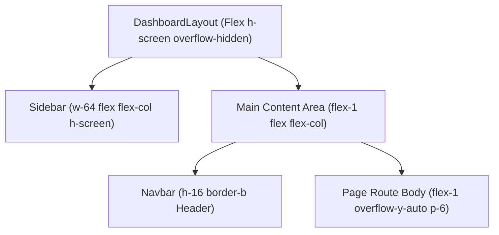

# 🎨 Design System & UI/UX Guidelines
## ApartmentMS – Visual Language & Layout Specifications

This document outlines the visual design system, color palette, typography scale, component anatomy, and responsive layout rules for the ApartmentMS web application.

---

### 1. Color Palette & Visual Tokens

| Token Name | Hex / Class | Visual Role & Context |
| :--- | :--- | :--- |
| **Primary 600** | `#2563eb` (`bg-primary-600`) | Main brand accent, primary CTA buttons, active state highlights |
| **Primary 700** | `#1d4ed8` (`bg-primary-700`) | Button hover states, topbar gradients |
| **Slate Dark 900** | `#111827` (`bg-gray-900`) | Sidebar background, contrast navigation container |
| **Slate Dark 800** | `#1f2937` (`bg-gray-800`) | Sidebar item hover state, active navigation pill background |
| **Emerald 500** | `#10b981` (`text-green-600`) | Paid bill badges, active status indicators, occupied stats |
| **Amber 500** | `#f59e0b` (`text-amber-500`) | Pending warnings, password security icons, notice alerts |
| **Rose 500** | `#ef4444` (`text-red-500`) | Overdue bill alerts, delete actions, unassign buttons |
| **Surface Light** | `#f8fafc` (`bg-gray-50`) | Global page body background |

---

### 2. Component Layout & Responsive Architecture

---

### 3. Layout Specifications & Viewport Standards

| Component | Desktop (`lg:`) | Mobile (`< lg`) | Scroll & Overflow Policy |
| :--- | :--- | :--- | :--- |
| **Sidebar Container** | `static w-64 h-full flex flex-col` | `fixed inset-y-0 left-0 z-30 transform` | Fixed header/footer; middle `<nav>` uses `custom-scrollbar` |
| **Navbar Header** | `h-16 px-6 bg-white border-b` | `h-16 px-4 flex items-center` | Sticky top boundary with mobile drawer toggle button |
| **Page View Body** | `flex-1 overflow-y-auto p-6` | `flex-1 overflow-y-auto p-4` | Scrollable view boundary independently isolated from sidebar |
| **Data Tables** | `w-full overflow-x-auto` | `block overflow-x-auto` | Horizontal scroll wrapper on narrow viewports |
