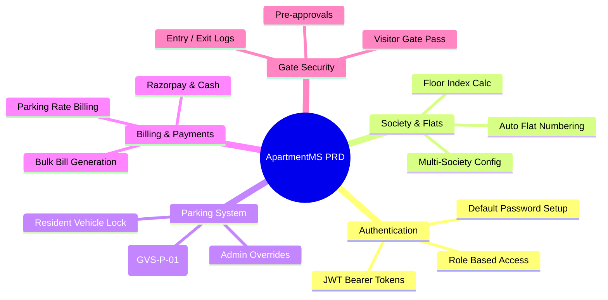
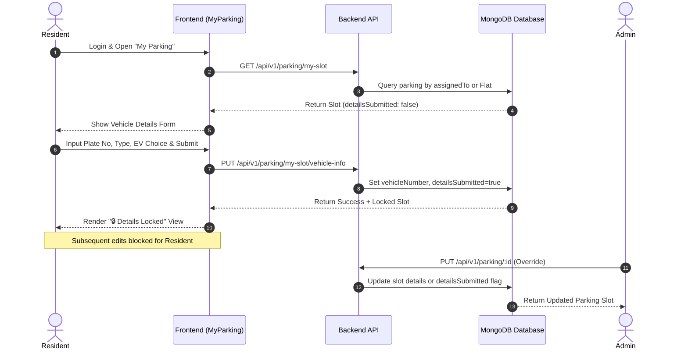
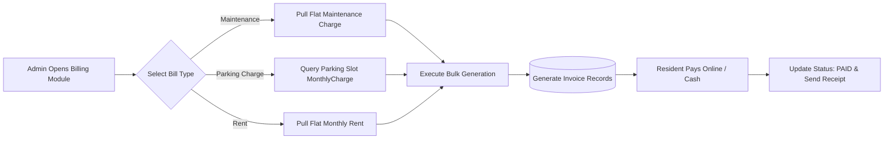

# Product Requirement Document (PRD)
## Apartment Management System (ApartmentMS)

---

## 1. Feature Matrix & System Scope

---

## 2. User Roles & Permission Matrix

| Role | Access Scope | Society Config | Flat Management | Vehicle Lock Override | Bulk Billing | Visitor Approval |
| :--- | :--- | :---: | :---: | :---: | :---: | :---: |
| **System Admin** | Global System Access | ✅ Full | ✅ Full | ✅ Full | ✅ Full | ✅ Full |
| **Resident (Owner/Tenant)** | Self Flat & Parking | ❌ Read Only | ❌ Read Only | ❌ Submit Only | ❌ Pay Only | ✅ Pre-approve |
| **Security Guard** | Gate & Parking Logs | ❌ None | ❌ Read Only | ❌ None | ❌ None | ✅ Verify Pass |
| **Maintenance Staff** | Complaints & Waste Logs | ❌ None | ❌ Read Only | ❌ None | ❌ None | ❌ None |

---

## 3. Vehicle Registration & Locking Workflow

---

## 4. Flat & Parking Auto-Assignment Matrix

| Flat Number Format | Society Acronym | Derived Floor | Default BHK | Auto-Generated Parking Tag |
| :--- | :--- | :--- | :--- | :--- |
| **GVS-01** | GVS | Floor 1 | 2BHK | `GVS-P-01` |
| **GVS-02** | GVS | Floor 1 | 2BHK | `GVS-P-02` |
| **GVS-03** | GVS | Floor 1 | 3BHK | `GVS-P-03` |
| **GVS-04** | GVS | Floor 1 | 4BHK | `GVS-P-04` |
| **GVS-05** | GVS | Floor 2 | Penthouse | `GVS-P-05` |

---

## 5. Billing & Payment Workflow

---

## 6. Non-Functional Requirements & Performance Benchmarks

| NFR Domain | Requirement Metric | Target Standard | Compliance Method |
| :--- | :--- | :--- | :--- |
| **Page Load Speed** | First Contentful Paint (FCP) | $< 1.2\text{s}$ | Vite asset bundling & React lazy load |
| **Build Efficiency** | Production Build Time | $< 2.5\text{s}$ | Rolldown / Vite tree-shaking |
| **Security** | Auth Token Expiration | 24 Hours | JWT Bearer Token validation |
| **Layout Flexibility** | Mobile Drawer & Sticky Sidebar | 100% Viewport Height | CSS Flexbox + `custom-scrollbar` |
