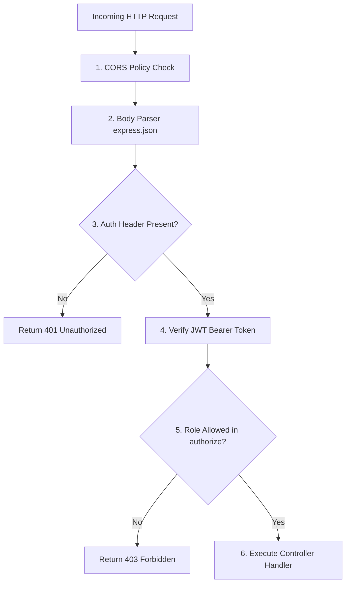

# 📜 Development Guidelines & System Rules
## ApartmentMS – Development & Architecture Rules

This document specifies the mandatory coding rules, security policies, API response contracts, and quality control standards for developing and maintaining the ApartmentMS application.

---

### 1. Core System Mandates

| Rule Domain | Mandate Constraint | Rationale & Enforcement |
| :--- | :--- | :--- |
| **API Authentication** | All non-auth API endpoints must use `protect` middleware. | Prevents unauthenticated access to system resources. |
| **Role Authorization** | Endpoints modifying data must specify allowed roles via `authorize(...)`. | Enforces strict Role-Based Access Control (RBAC). |
| **Flat-Parking Sync** | All flat creations/assignments must call `syncParkingForFlat(flat)`. | Maintains 1-to-1 parity between flat records and parking slot tags. |
| **Vehicle Detail Lock** | `detailsSubmitted` flag must be checked in `/my-slot/vehicle-info`. | Prevents residents from changing plate numbers after registration. |
| **Default Credentials** | Admin-created security & staff accounts receive fixed defaults (`Security123` / `Staff123`). | Enables initial login while allowing immediate password changes. |

---

### 2. Security Architecture & Middleware Pipeline

---

### 3. API Response Contract Standards

| HTTP Status | Category | Response Schema Standard |
| :--- | :--- | :--- |
| **200 OK** | Successful Query / Update | `{ message?: string, <data_key>: object | array }` |
| **201 Created** | Entity Created | `{ message: string, <entity_key>: object }` |
| **400 Bad Request** | Validation Failure | `{ message: "Descriptive error message string" }` |
| **401 Unauthorized** | Missing / Invalid Token | `{ message: "Not authorized, token failed" }` |
| **403 Forbidden** | Role Insufficient | `{ message: "User role 'staff' is not authorized to access this route" }` |
| **404 Not Found** | Missing Resource | `{ message: "Resource not found" }` |

---

### 4. Code Quality & Build Verification Rules

1. **Clean Production Bundling**:
   - Before completing any feature task, developers MUST execute `cmd /c npm run build` in the `frontend/` directory.
   - The build MUST exit with code `0` and zero syntax or import errors.

2. **No Placeholders or Broken Links**:
   - Use dynamic SVG icons (`react-icons/fa`) or generated assets. Never leave broken relative path image placeholders.

3. **Responsive Viewport Standard**:
   - Layouts must implement flexible flexbox height (`h-screen lg:h-full`) and custom scrollbars (`custom-scrollbar`) to prevent double scrollbars.
