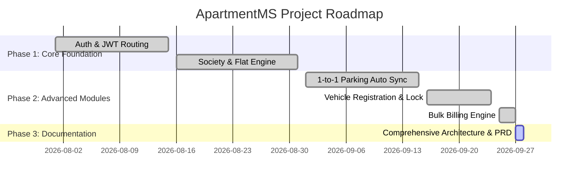

# 📋 Project Task Board & Roadmap
## ApartmentMS – Feature Execution & Task Tracking

This document tracks completed features, current sprint work items, roadmap progress, and system maintenance logs for ApartmentMS.

---

### 1. Task Execution Matrix

| Task ID | Feature Description | Category / Module | Target Role | Status |
| :--- | :--- | :--- | :--- | :---: |
| **TSK-01** | JWT Authentication & RBAC Middlewares | Core / Security | All Roles | ✅ Completed |
| **TSK-02** | Multi-Society & Block Configuration | Admin / Societies | Admin | ✅ Completed |
| **TSK-03** | Auto Flat Calculation & BHK Presets | Admin / Flats | Admin | ✅ Completed |
| **TSK-04** | 1-to-1 Parking Auto-Matching (`GVS-P-01`) | Admin / Parking | Admin / Resident | ✅ Completed |
| **TSK-05** | Resident Vehicle Detail Registration & Permanent Locking | Resident / Parking | Resident | ✅ Completed |
| **TSK-06** | Admin Parking Rate Override & Unlock Controls | Admin / Parking | Admin | ✅ Completed |
| **TSK-07** | Bulk Invoice Generation Engine | Admin / Billing | Admin | ✅ Completed |
| **TSK-08** | Slideable Sidebar with Independent Custom Scrollbar | Frontend / Layout | All Roles | ✅ Completed |
| **TSK-09** | Security & Staff Accounts with Default Credentials | Admin / Users | Security / Staff | ✅ Completed |
| **TSK-10** | Embedded Interactive AI Chat Bubble | Common / AI | All Roles | ✅ Completed |
| **TSK-11** | Gate Security Visitor Passes & Logs | Gate Security | Security | ✅ Completed |
| **TSK-12** | Society Complaints Ticketing Workflow | Maintenance | Admin / Resident | ✅ Completed |

---

### 2. Milestone Timeline

